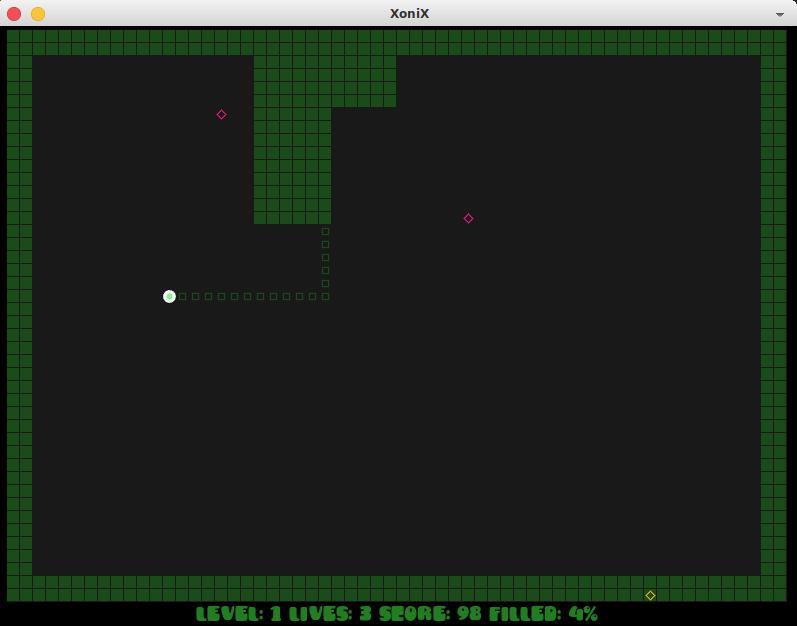

# Xonix 

Xonix game implementation in Lua on wonderfull [LÖVE](https://love2d.org/) framework. Hacked on holidays in end of March, 2022.

Self reference: https://github.com/bz007/xonix

## How to Run

Just download latest xonix.love from Releases page and open it with installed LÖVE.

## Game Control

The game can be controlled with keyboard (arrows ← → ↑ ↓ for movements and Enter as Fire) or gamepad (any joystick for movements and A as Fire). Also in main screen you can press F to toggle fullscreen and M to toggle background music, use + and - to adjust its volume. Button Q is for quit game, and Esc or Fire is used for pause during the game. When you press Fire button in main screen then game control is fixed to device where you press Fire and game starts.

## TODO
 * add player name in hiscore
 * separate setup screen with video, music and game control?
 * clean up most global variables?
 * more useful context switching?

## Just some copyright notices

Many thanks to all this people who helped me to reach the goal even they do not know about it.

Background music by https://pixabay.com/music/upbeat-fun-kids-playful-comic-carefree-game-happy-positive-music-57026/

Sound Effects by GameBurp.com

Font by https://fontkong.com/product/moulin/
